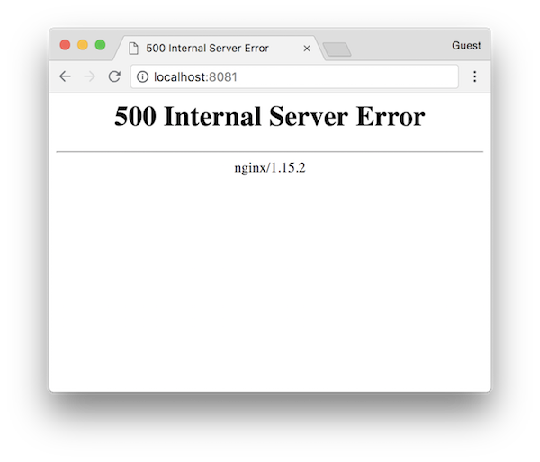

# nginx-internal-server-error-dockerfile
[](https://hub.docker.com/r/nwtgck/nginx-internal-server-error/)  

Nginx Docker image which always returns "500 Internal Server Error"

## Run

Here is how to run a server which always returns "500 Internal Server Error."

```bash
docker run -p 8081:80 --rm nwtgck/nginx-internal-server-error
```

Then, you can access to <http://localhost:8081> and have the following window.


